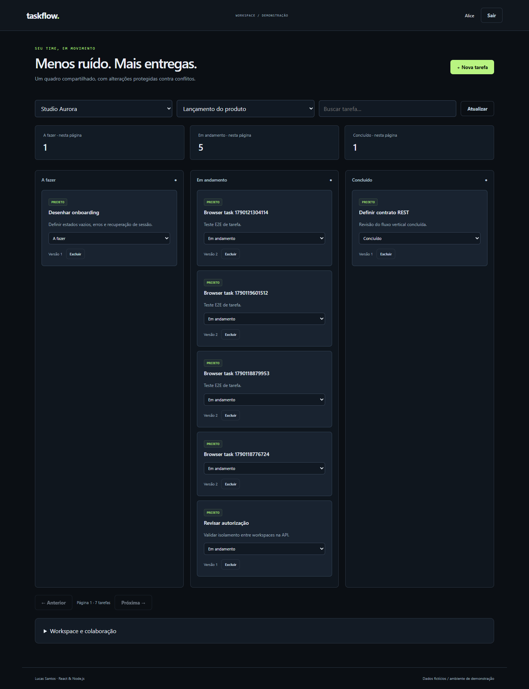
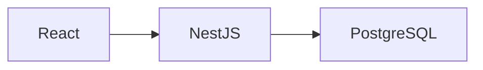

# Taskflow

SaaS de gestão de projetos: workspaces isolados, Kanban, permissões e auditoria.

[](https://github.com/Lucass-Gs/taskflow/actions/workflows/ci.yml)

Projeto de portfólio em React, TypeScript e Node.js/NestJS. Versão funcional de demonstração, com dados fictícios e testes reproduzíveis.



## Executar com Docker

Requisitos: Docker Engine/Desktop em execução e Docker Compose v2. Node.js 24 é necessário apenas para desenvolvimento e testes locais.

```sh
git clone https://github.com/Lucass-Gs/taskflow.git
cd taskflow
docker compose up --build -d --wait
docker compose --profile tools run --rm seed
```

Abra http://localhost:4101. O seed pode ser executado novamente sem apagar dados. Use um perfil de navegador diferente para duas sessões simultâneas.

| Usuário fictício   | Senha local |
| ------------------ | ----------- |
| alice@example.test | Demo1234!   |
| bruno@example.test | Demo1234!   |
| carla@example.test | Demo1234!   |

A configuração padrão funciona sem arquivo .env. Para personalizar, copie .env.example para .env antes da primeira execução. Os valores publicados são exclusivamente credenciais locais de demonstração. As portas são expostas apenas em 127.0.0.1. Alterar a senha do PostgreSQL após inicializar o volume exige também alterar a credencial no banco.

## O que está implementado

- Workspaces e projetos com associação explícita de usuários e autorização por recurso.
- Kanban com pesquisa na URL, paginação, criação de tarefas e atualização otimista com rollback.
- Controle de versão: duas alterações concorrentes resultam em um sucesso e um conflito HTTP 409.
- Convite de usuário já cadastrado, papéis admin/member e registro de alterações.

## Roteiro de demonstração

1. Entre como Alice, crie uma tarefa com descrição e altere seu status.
2. Abra outra sessão como Bruno para colaborar no mesmo workspace. Carla pertence a outro workspace.
3. Consulte a auditoria. O teste de integração executa duas alterações concorrentes com a mesma versão.

## Arquitetura



Um monólito modular atende este domínio sem o custo operacional de microserviços. A versão da tarefa participa do UPDATE e transforma conflitos em uma resposta explícita. Todas as consultas de recursos verificam associação ao workspace; esconder botões não é autorização.

[Decisões técnicas](docs/DECISIONS.md) · [Operação e diagnóstico](docs/RUNBOOK.md) · [Validação](docs/VALIDATION.md)

## Testes

Com o Compose inicializado e o seed aplicado:

```sh
npm ci
npm run typecheck
npm run build
npm test
docker compose --profile test run --build --rm tests
npx playwright install chromium
npm run test:e2e
```

No Windows, use npm.cmd se a política do PowerShell bloquear npm.ps1. O Playwright usa Microsoft Edge no Windows e Chromium no Linux. Testes de integração criam dados e operações fictícias; execute em ambiente de demonstração. O workflow GitHub Actions também cria o ambiente Docker e executa integração e navegador.

## Estrutura

- apps/api/src: API, autenticação, persistência e domínio.
- apps/web: interface React.
- db: migrations SQL e dados de demonstração no seed da API.
- tests: testes unitários, integração e navegador.
- infra: proxy e/ou configurações de infraestrutura.

## Limites e próximos passos

Storybook, testes de componentes, medições com React Profiler, convite por e-mail e contrato OpenAPI ainda não foram implementados.

O código demonstra decisões técnicas; senioridade também depende de explicar os trade-offs, manter sistemas e colaborar com uma equipe.

## Autor

Lucas Santos · [LinkedIn](https://www.linkedin.com/in/lucass-gs/) · [GitHub](https://github.com/Lucass-Gs)
